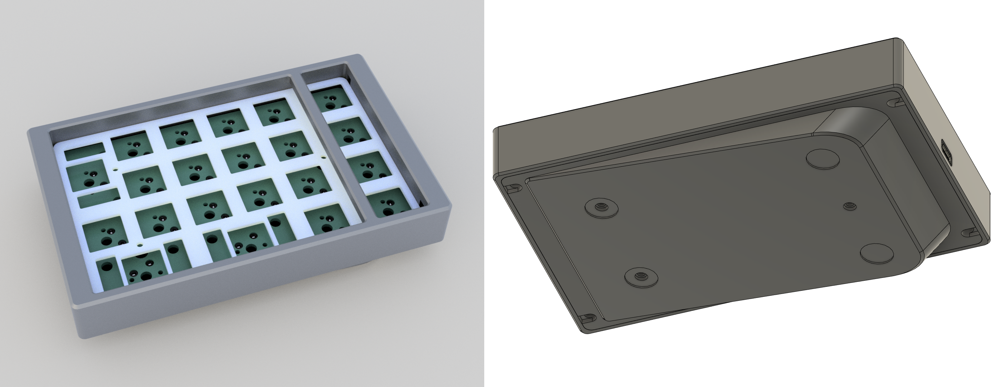

[자작 과정(kr)](https://blog.naver.com/cosmosalad/223262540878)  

# Gearpad 
Gearpad is a 20% korean 천지인 keyboard based on the rp2040.

[천지인 연습 사이트](https://cosmosalad.github.io/gearpad/)

 

- gearpad

    
  

  

  

  

