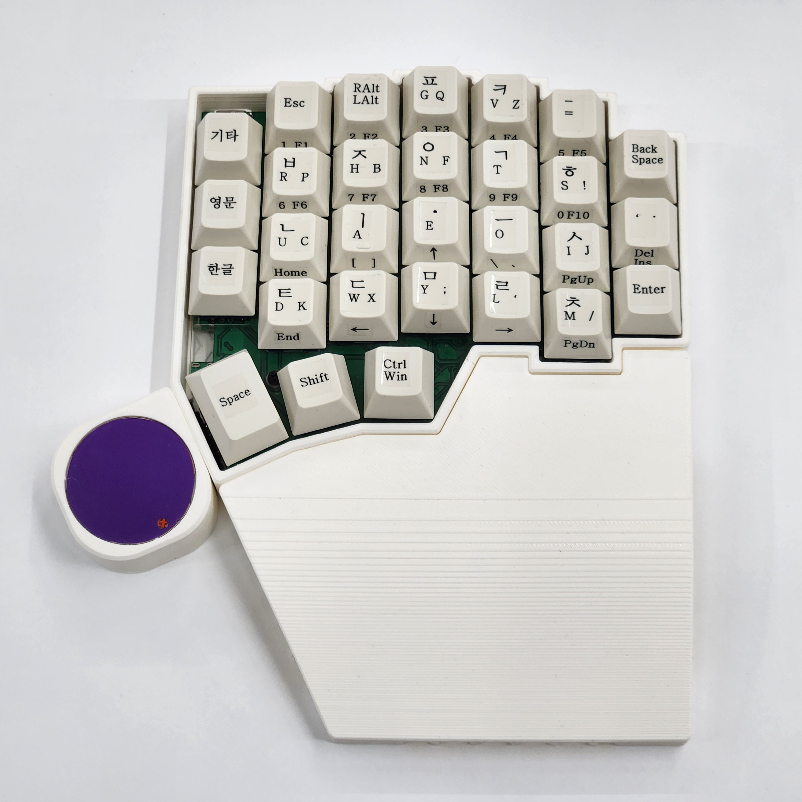
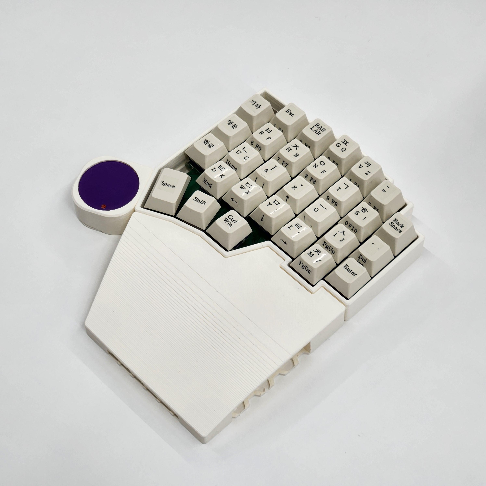
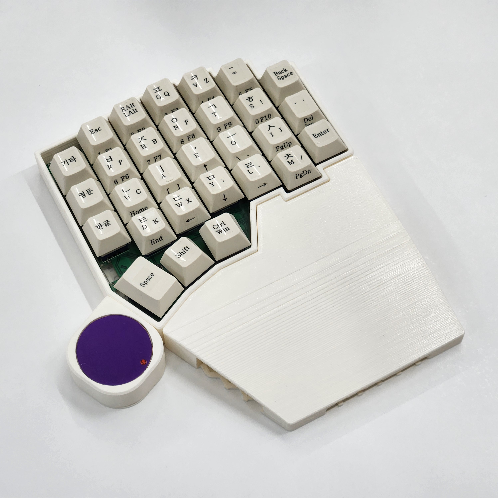
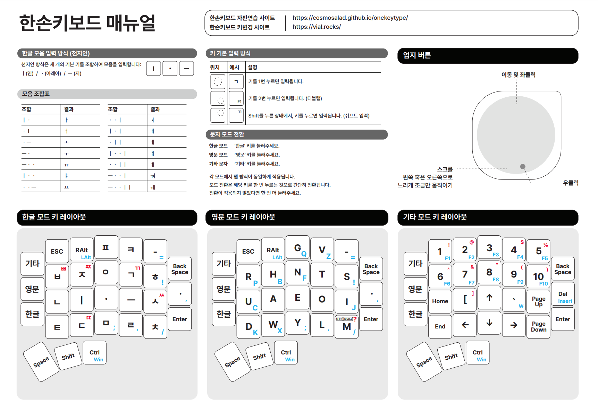

[자작 과정(kr)](https://blog.naver.com/cosmosalad/223262540878)  

# Onekey(한손키보드) 
천지인 형식 기반 한손 키보드

[▶ 전용 자판 연습 사이트](https://cosmosalad.github.io/onekeytype/)

[▶ 키 매핑 사이트](https://vial.rocks/)

 

- Onekey v1.0

  
  
  

  

  

